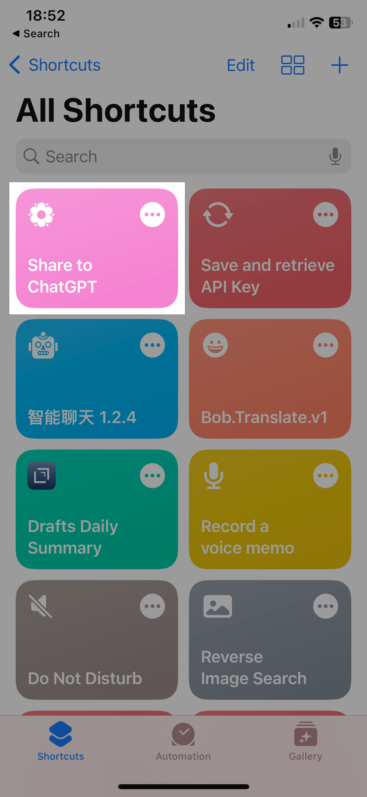
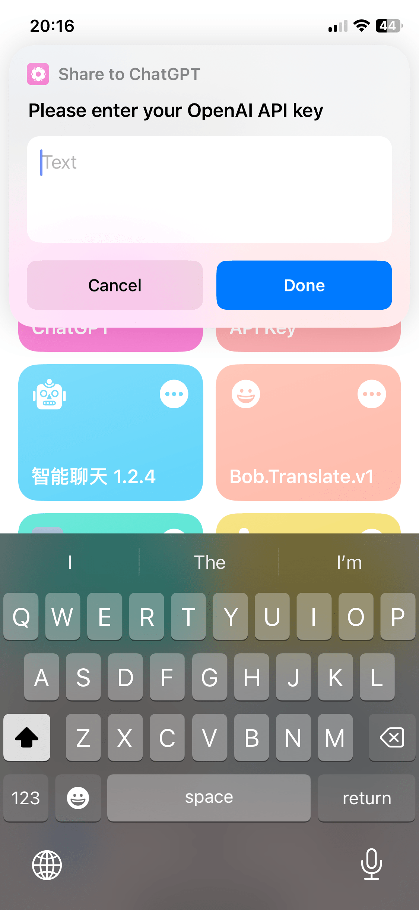
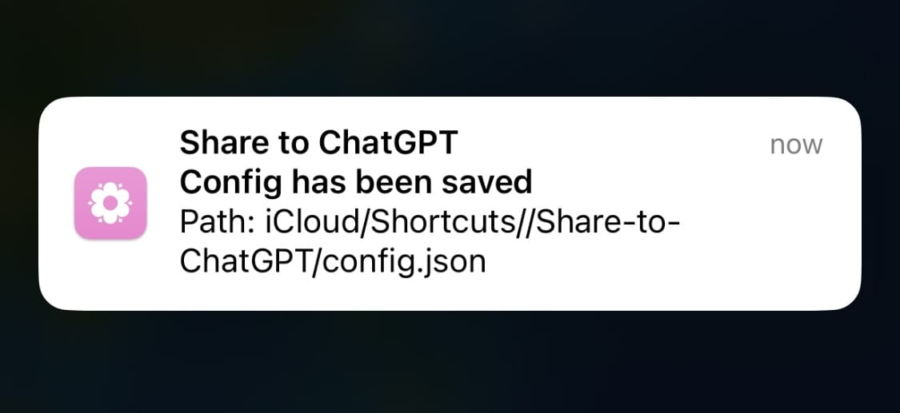
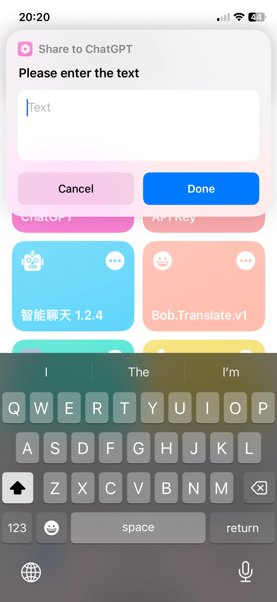

# Share to ChatGPT Shortcut

The Share to ChatGPT feature is an Apple Shortcut that allows users to share highlighted text to ChatGPT while also including personalized prompts. Additionally, the response message will automatically be copied to the user's clipboard.

## Installation

- 2023-03-25: https://www.icloud.com/shortcuts/9cd41f860ef2473aa9d69931b1cb0e19

## Setup

Follow the steps below to set up the shortcut.

| Step 1 | Step 2 | Step 3 | Step 4 |
| :----: |:------:|:------:|:------:|
| Open "Share to ChatGPT" in Shortcuts.app | After clicking "Done," enter your OpenAI API key in the dialog box. You will then receive a notification that confirms the configuration path. | Type something like "hello" for testing purpose, and choose a builtin prompt like "chat". | Click "Allow" for every confirmation dialog. |
|  |  |  |  |

## Usage

After installation, the shortcut will be available in the share sheet. To use the shortcut, highlight the text you want to share to ChatGPT and tap the share button. Then, select the shortcut and tap "Run Shortcut". The shortcut will then prompt you to enter a prompt. After entering a prompt, the shortcut will send the text to ChatGPT and copy the response to your clipboard.

## Prompts

The shortcut has the following built-in prompts.

You can also add your own prompts by editing the shortcut.
